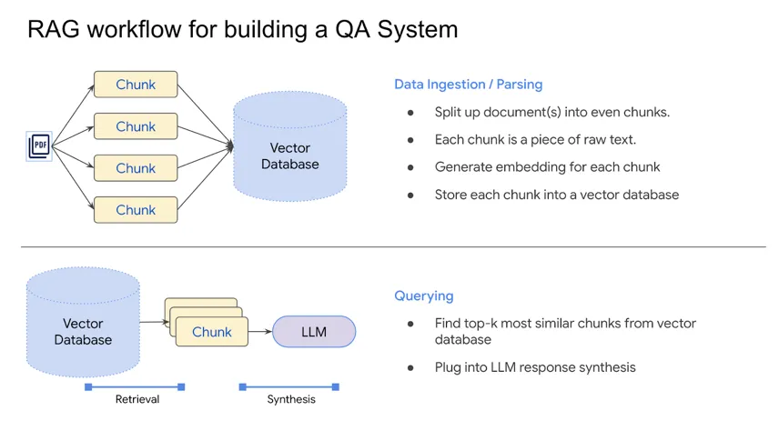
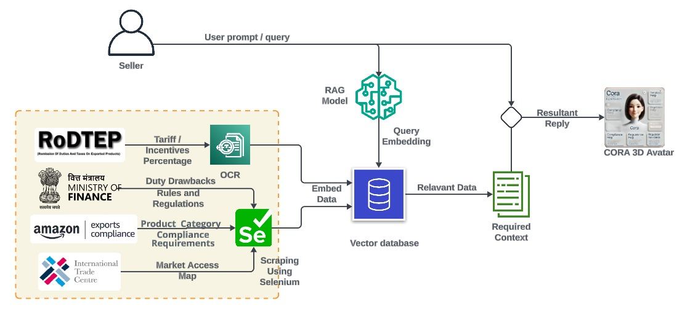

# Website Scraper and RAG Pipeline 

This repository demonstrates a **web scraping and Retrieval-Augmented Generation (RAG)** workflow. The code scrapes websites for textual and PDF data, processes the collected data, and enables natural language queries using an AI-powered Retrieval-Augmented Generation pipeline.

The scraping is performed over permitted government websites and uses some more publicly available websites like the Amazon Exports Compliance

---
## INSTALLATION
  1) Clone the repo locally
  2) Run the following
```
python -m venv env

source env/bin/activate

pip install -r requirements.txt
```
  3) Run
```
python main.py
```

---

## Features

1. **Website Crawling and Scraping**  
   - Crawls websites and downloads PDFs and extracts textual data from HTML pages.

2. **Document Handling**  
   - Supports loading text from PDFs and plain text files using `LangChain` loaders.
   - Splits documents into manageable chunks for efficient embedding generation.

3. **Vector Database and Embeddings**  
   - Generates vector embeddings for document chunks using **Google Generative AI Embeddings**.
   - Stores embeddings in **Chroma** vector database for efficient similarity search.

4. **Retrieval-Augmented Generation (RAG)**  
   - Creates a retriever to fetch relevant document chunks based on queries.
   - Generates concise, context-aware answers using **ChatGoogleGenerativeAI**.

---
## Implementation

**RAG ARCHITECTURE**



### **Generate Embeddings and Store in Vector Database**
```python
embeddings = GoogleGenerativeAIEmbeddings(model="models/embedding-001", google_api_key=os.getenv("GOOGLE_API_KEY"))
vectorstoredb = Chroma.from_documents(documents=docs, embedding=embeddings)
retriever = vectorstoredb.as_retriever(search_type="similarity", search_kwargs={"k": 5})
```

### **RAG Query Pipeline**
Set up the RAG pipeline for querying the data:
```python
llm = ChatGoogleGenerativeAI(model="gemini-1.5-flash", temperature=0.3, google_api_key=os.getenv("GOOGLE_API_KEY"))
system_prompt = (
   "You are a government expert in import and export regulations. Provide clear, concise answers based on the provided context. "
   "If the information is not found in the context, state that the answer is unavailable. "
   "\n\n{context}"
)
prompt = ChatPromptTemplate.from_messages([("system", system_prompt), ("human", "{input}")])
chain = create_stuff_documents_chain(llm, prompt)
rag_chain = create_retrieval_chain(retriever, chain)
```

**OVERALL ARCHITECTURE**



**Data Sources For Web Scraping:**
The tool connects to multiple government and third-party resources, including:
	- RoDTEP Portal for tariff incentives and export benefits.
	- Ministry of Finance for duty drawbacks and regulations.
	- Amazon Export Compliance for Product Documentation (US Imports)
	- International Trade Centre, and DGFT portals for product-specific compliance requirements.
We intend to establish a CRON job on AWS which periodically fetches data from these websites and updates the vector database

**Query Processing (RAG Model):**
The input is embedded into a Retrieval-Augmented Generation (RAG) model, which:
	- Converts the query into a vectorized embedding.
	- Retrieves relevant data based on the query context from a vector database.

Using the retrieved data, the system constructs a relevant context, aligning insights with the user's query.
The compiled information is displayed back at the 3D Avatar (CORA) interface, providing an intuitive, conversational experience to the user.

---

## Example Query and Response
- **Query**: *"What is required in the certification for eyewear export?"*  
  **Response**: *"Exporters of spectacles/sunglasses must ensure that the lenses are tested and certified for impact resistance.  Additionally, FDA registration and listing, product labeling per FDA guidelines, and adherence to FDA quality system requirements are mandatory."*

---

## Future Improvements
- **Scaling**: Enhance crawling to handle multiple domains concurrently.
- **Integration**: Extend support for additional file types (e.g., DOCX, PPT).
- **Performance**: Optimize vector store operations for large datasets.

---

## License
This project is open-source and available under the MIT License.

---

## Acknowledgments
- **LangChain**: For document processing and text generation.
- **Google Generative AI**: For embeddings and AI-powered responses.


